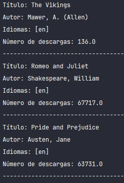

<h1 align="center">Catálogo de Libros</h1>
<h1 align="center">
  
   
  
  
  
  
  
    
</h1>

## Preview

## Description
Aplicación de Catálogo de Libros, implementando la persistencia de datos, el consumo de API, haciendo uso de framework Spring-boot y JPA 

## Usage
Esta Aplicación es con fines educativos, para poner en practica conocimientos adquiridos durante los diversos cursos de Programación orientada a Objetos con Java + Spring

## Author
 © JCodev11-2024

## Support
https://www.linkedin.com/in/jcodev/

## License
MIT
